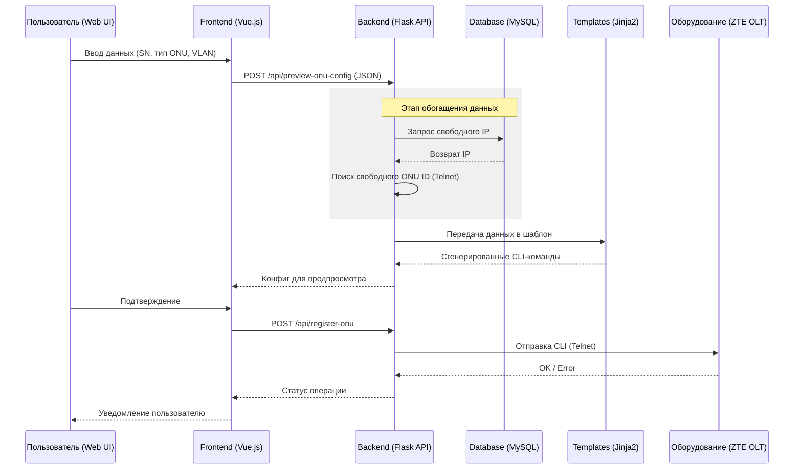

# Структура README для PONHub, адаптированная под требования дипломной работы:

  ---

  PONHub: Система автоматизации управления и регистрации абонентского оборудования в сетях GPON

  📝 Описание проекта
  PONHub — это веб-ориентированная программная система, предназначенная для автоматизации процесса регистрации и настройки ONU (Optical Network Units) на коммутаторах OLT (Optical Line Terminals)
  производства ZTE. Проект решает задачу минимизации ручного ввода CLI-команд, снижения вероятности ошибок конфигурации и ускорения процесса подключения новых абонентов в сетях провайдеров (ISP).

  🚀 Основные возможности
   - Автоматическое обнаружение: Поиск незарегистрированных ONU на OLT в реальном времени.
   - Интеллектуальный подбор параметров: Автоматический поиск свободных IP-адресов (интеграция с БД) и свободных ID на портах OLT.
   - Шаблонизация конфигураций: Генерация CLI-команд на основе Jinja2-шаблонов для различных моделей оборудования.
   - Предварительный просмотр: Анализ и валидация конфигурации перед её применением.
   - Multi-OLT поддержка: Управление несколькими узлами агрегации через единый интерфейс.
   - Мониторинг: Получение MAC-адресов клиентских устройств для диагностики.

  🛠 Технологический стек
  Backend
   - Язык: Python 3.x
   - Фреймворк: Flask (Blueprints для модульности)
   - Протоколы: Telnet (библиотека telnetlib)
   - Шаблонизатор: Jinja2
   - База данных: MySQL (через PyMySQL)
   - Конфигурация: YAML (динамическая загрузка с автообновлением)

  Frontend
   - Язык: JavaScript (TypeScript ready)
   - Фреймворк: Vue.js 3 (Composition API)
   - Сборщик: Vite
   - Управление состоянием: Pinia
   - Стилизация: Bootstrap 5 & Bootstrap Icons

  🏗 Архитектура системы
  Проект построен по классической клиент-серверной архитектуре:
   1. Frontend: Одностраничное приложение (SPA), обеспечивающее взаимодействие пользователя с логикой регистрации.
   2. REST API: Прослойка на Flask, обрабатывающая запросы, взаимодействующая с БД и управляющая сессиями Telnet.
   3. Оборудование (OLT): Конечные устройства, на которых применяются изменения через CLI.

  📂 Структура проекта
```
    1 PONHub/
    2 ├── backend/                # Серверная часть (Flask API)
    3 │   ├── blueprints/         # Логика API (ONU, Utils)
    4 │   ├── config/             # Управление конфигурацией OLT (YAML)
    5 │   ├── modules/            # Ядро (Telnet-клиент, Regex-парсеры)
    6 │   │   └── onu_templates/  # Шаблоны конфигураций (.j2)
    7 │   └── app.py              # Точка входа Backend
    8 ├── frontend/               # Клиентская часть (Vue.js)
    9 │   ├── src/
   10 │   │   ├── views/          # Страницы приложения
   11 │   │   └── router/         # Навигация
   12 │   └── package.json        # Зависимости Frontend
   13 └── README.md
```
  ⚙️ Установка и запуск

  Предварительные требования
   - Python 3.10+
   - Node.js 18+
   - MySQL Server

  Настройка Backend
   1. Перейдите в директорию backend/.
   2. Создайте виртуальное окружение: python -m venv env.
   3. Установите зависимости: pip install -r requirements.txt.
   4. Настройте файл .env на основе .env_example.
   5. Отредактируйте backend/config/otls_config.yaml для добавления ваших OLT.
   6. Запустите сервер: ./run.sh или python app.py.

  Настройка Frontend
   1. Перейдите в директорию frontend/.
   2. Установите зависимости: npm install.
   3. Настройте адрес API в .env.
   4. Запустите в режиме разработки: npm run dev.

  🛡 Безопасность и надежность
   - Разграничение доступа к конфигурационным файлам.
   - Валидация входных данных на уровне API и фронтенда.
   - Обработка исключений при потере связи с OLT.
   - Потокобезопасная загрузка конфигураций.

  📈 Перспективы развития
   - Реализация поддержки протокола SSH (вместо Telnet).
   - Поддержка оборудования других вендоров (Huawei, Nokia, BDCom).
   - Интеграция с биллинговыми системами через API.
   - Добавление системы логирования действий пользователей (Audit Log).

  ---

  

---

## 🏗 Архитектура потоков данных (DFD)

Ниже показан полный путь данных — от ввода пользователем до выполнения команд на сетевом оборудовании.

---

## 📡 Процесс регистрации ONU



---

## 🔍 Ключевые этапы

### 1. 📥 Сбор и валидация данных

Frontend собирает:

* Серийный номер (SN)
* Тип ONU
* VLAN

И выполняет базовую проверку данных перед отправкой на backend.

---

### 2. ⚙️ Обогащение данных (Data Enrichment)

Backend:

* Запрашивает свободный IP из базы данных
* Опрашивает OLT для поиска свободного ONU ID

---

### 3. 🧩 Генерация конфигурации (Templating)

Используется шаблонизатор:

* Данные передаются в `.j2` шаблон
* Генерируется список CLI-команд для OLT

👉 Это позволяет:

* отделить логику от вендора
* легко менять шаблоны под другое оборудование

---

### 4. 🚀 Выполнение конфигурации (Execution)

Модуль Telnet:

* Подключается к OLT
* Выполняет команды последовательно
* Сохраняет конфигурацию (`write`)

---

### 5. 🔔 Обратная связь (Feedback)

Система:

* Анализирует ответ оборудования
* Возвращает результат во frontend
* Показывает пользователю статус операции

---

## 💡 Итог

Архитектура построена по принципу:

* **Frontend** — UI и валидация
* **Backend** — логика и orchestration
* **Templates** — генерация CLI
* **OLT** — исполнение

👉 Это делает систему:

* масштабируемой
* гибкой (под разных вендоров)
* удобной для автоматизации

---


